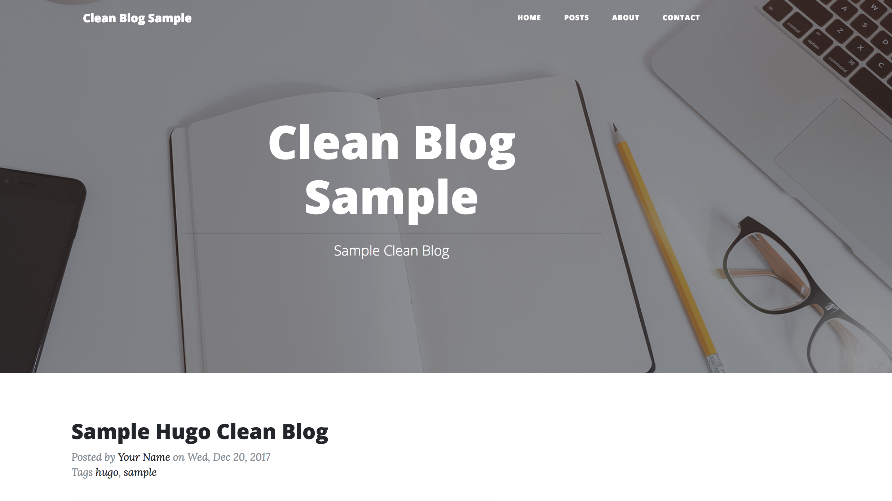

# About

- Hugo theme based on [Start Bootstrap Clean Blog](http://startbootstrap.com/template-overviews/clean-blog/).
- Hugo theme originally forked from [humboldtux/startbootstrap-clean-blog: Hugo theme based on Start Bootstrap Clean blog](https://github.com/humboldtux/startbootstrap-clean-blog) and updated to bootstrap4.

[Check sample website](http://dreamy-hoover-3f3499.netlify.com/)



## Install

In your, hugo project,

```bash
git submodule add https://github.com/Go-zen-chu/hugo-clean-blog-theme.git themes/clean-blog
```

From config.toml of your site, specify

```bash
theme = "clean-blog"
```

## How to develop

This theme uses [Start Bootstrap Clean Blog](http://startbootstrap.com/template-overviews/clean-blog/), so we need to bring all static things to this theme.
You can do that by using Makefile.

```bash
make all
```
